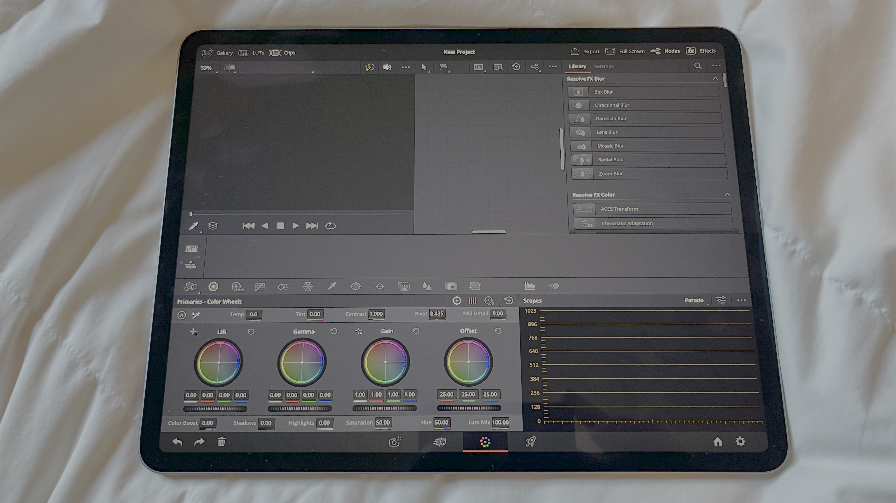
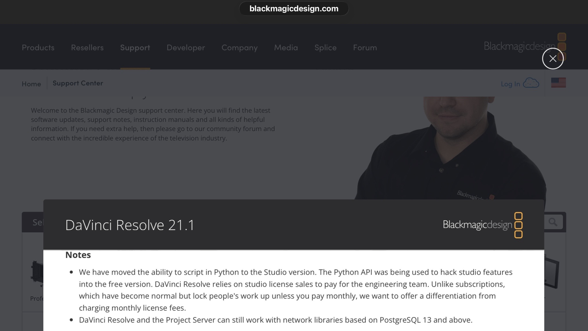
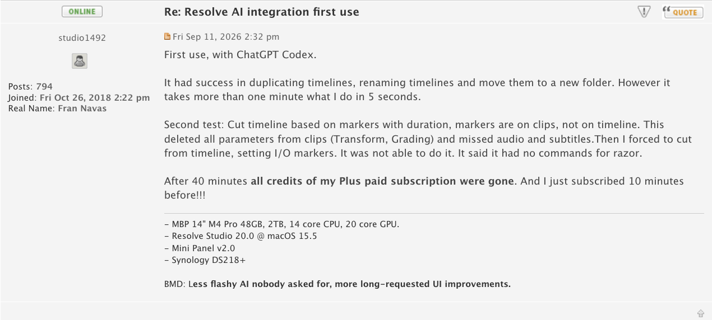

# Reactor Anywhere&trade; v5.0

> Roadmap Draft 1 (2026-09-15)  
> Written by: [Andrew Hazelden](mailto:andrew@andrewhazelden.com)  

What would it look like if you could have the identical “Reactor Package Manager” user experience but access it purely via a web browser session that still retained the best parts of the Reactor app-like user interface? After the literal shock, awe (and honestly, sheer horror) that was IBC 2026's BMD product launches: A design concept emerged for the next evolution of the WSL Fusion Community based [Reactor project](https://gitlab.com/WeSuckLess/Reactor).

Reactor staff work hard every day in our long-term quest to fully support the ~500K plus active users of the Reactor Package Manager and its included content and learning resources. At the moment, that means supporting the two unique software interfaces used via [Reactor Classic](https://gitlab.com/WeSuckLess/Reactor) / [Reactor Standalone](https://github.com/Kartaverse/Reactor-Standalone). 

We continuously put our best efforts and ideas into action with the Reactor project today, tomorrow, [the day-after-tomorrow](https://www.youtube.com/watch?v=HUBDFoMNXzA), and beyond, by delivering the "extended" Fusion community-made content to the web in new ways. This requires us to keep moving forward, adopt new Reactor application designs, and roll out ever-improving download mechanisms.

Additionally, over the last year and a bit, Reactor's core repository management functionality expanded to work with the latest Resolve/Fusion release. We added the capacity to serve broader creative software spaces like [Assimilate Scratch and LiveFX](https://gitlab.com/WeSuckLess/Reactor-for-Assimilate), [OpenFX](https://gitlab.com/WeSuckLess/Reactor-for-OpenFX), [JangaFX](https://gitlab.com/WeSuckLess/Reactor-for-JangaFX), [SideFX Houdini](https://gitlab.com/WeSuckLess/Reactor-for-Houdini), [LightWave](https://gitlab.com/WeSuckLess/Reactor-for-LightWave), and even for VFX/XR/Media production [Pipelines](https://gitlab.com/WeSuckLess/Reactor-for-Pipelines), too.

(Click to play the YouTube Video)

## The Reactor Web App Concept and why it's Needed

The concept behind the new Reactor Anywhere repo effort is to create the next generation of web-browser session-operated Reactor tools with responsive, slick, well-thought-out user interfaces that react automatically to the active device used to view the Reactor web app.

This app redesign process will allow the end user to entirely skip the need to install a [Reactor Standalone](https://github.com/Kartaverse/Reactor-Standalone) desktop application locally on their laptop or workstation. And it further builds on the base 2018 version of Reactor that we all know and love. 

That original WSL Reactor edition is today known colloquially as "Reactor Classic", as it uses a [Reactor.lua](https://gitlab.com/WeSuckLess/Reactor/-/blob/master/System/Reactor.lua?ref_type=heads) file and the BMD UI Manager API that both require “advanced” LuaJIT scripting capabilities to exist in the host Resolve Studio / Fusion Studio DCC application.

This advanced scripting support was previously a feature in the Freemium Fusion Free v7 to v9.0.2, and Resolve Free v15 to v19.0.3 programs. 

## What will the new Reactor WebUI look like?

With the upcoming Reactor Anywhere release, it will feel a lot like a supercharged, fast, browser based remake of Reactor Standalone's existing UI. Gone are the initial Reactor Standalone beta application's pokey startup times, slow atom package syncing speed, and the extra bit of lag like delays when switching categories and clicking around in the user interface. 

We want Reactor Anywhere to set a newly improved standard of running smooth-as-butter. That is the major goal for the web-hosted experience, as you navigate your way across the full Reactor user interface.

We plan to take the best parts of the Reactor Classic/Reactor Standaline user interface elements, and carry that forward with the help of modern HTML5/Javascript/REST based technology. The working concept is to be able to deliver what is called a "Single-File Web App" to the Reactor end user, as well. This is also known in other circles as a "Standalone HTML" setup.

Here is what the current Reactor Standalone desktop app user interface looks like for reference: 

## Resolve Studio for iPad Compatible

With Reactor Anywhere, you will be able to run the Reactor WebUI on an iPad's Safari or Chrome browser. You can download your favourite packaged content. Then the Files app will allow you to install the Atom packaged content that makes sense to use with [Resolve Studio for iPad](https://apps.apple.com/us/app/davinci-resolve-for-ipad/id1581363826). Now, how cool is that?

A special Reactor Anywhere compatible version of the "KickAss Shaderz for iPad" atom package is also being prepared. This will help to bring the classic "[KAS shaders](https://kartaverse.github.io/Reactor-Docs/#/com.wesuckless.KickAssShaderZ?id=kickass-shaderz)" over to tablet-based artists. It will even support the "Resolve Studio for iPad" (WIP) Fusion page environment.

## What Atom Content Will Reactor Anywhere Support Initially?

The new JSON-based Reactor atom package will allow you install file formats like:

Content:
- Macros .setting
- DCTLs .dctl
- LUTS
- Audio
- Movies
- RAW Video Formats
- Images / Image Sequences
- 3D Geometry
- Point Clouds
- Camera Tracking Data
- ST Map Warping Templates
- Roto Shape Data
- Resolve:
	- Projects .dra, .drp
	- Timelines .drt
	- Bins .drb
	- Grades .drx
- Fusion:
	- Composites .comp
	- Custom PathMaps
	- Custom Variable Maps
	- Custom Toolbars
	- Custom Guide Grids .guide
	- Confg Files .fu, .zfu based Menus/Hotkeys/Events/Actions
	- Fusion Render Manager Queues

Mograph:
- Effects Templates .drfx, .setting
- OGraf .json
- Lottie .lottie
- Fonts .ttf, etc…
- JSON .json, .jsonc
- Spreadsheets .csv, .tsv, .xls, etc.

Plugins:
- Fuses .fuse
- FusionSDK C+ .plugin
- OpenFX C++ Plugin Bundle
- Workflow Integrations / Deliver Page Exporters
- VST Audio Plugin .vst

## Why is this Reactor migration to the web even required?

BMD has made it clear at [Resolve v21.1](https://www.blackmagicdesign.com/support/readme/59dd4eef1f4941c29fb8dc48b33f5c8) that 3rd-party developers should respect the core tenets of BMD's Freemium/Paid business model. That effectively means we (the Reactor project) need to consider scaling back the use of LuaJIT advanced scripting, UI Manager, Python scripting, PySide, and similar functionality in the Reactor Package Manager's own GUI, and in separate atom packages. 

This will likely lead to more Edit page dctls, Ograf motion graphics files, effects templates, as well as as macros and fuses being shared via Reactor.

In my view, a package manager in this environment is aimed at onboarding and helping the initial user base of new users. Hopefully they like the experience and stick around to grow into the next generation of indie VFX artists, then eventually become full-time pros over several years.

The WeSuckLess&trade; developers, meaning specifically the two-person team behind the Reactor core project, Andrew and SecondMan, want to be good corporate citizens in the BMD community. So in good faith, we're biting the bullet and will have to "tow that BMD line", to a certain degree, in solidarity with the mothership at BMD SG. Yesh. Really... WTF is this world coming to? It's literally breaking at the seams. 🙈🙊🙉

## What happened to BMD and its decade-long post-production software product tiers?

As always, things change. Many students, teachers, retired seniors, NGO volunteers, indie artists, and hobbyists got started with the Freemium tools, then "levelled up" to the excellent paid Studio products as part of their learning journey. 

The symbiosis of a BMD freemium path that directly led to the paid BMD Studio offerings helped fuel a quite frankly meteoric rise for the software among millions of artists/creators. For better or for worse, the base BMD software product tiers, the unique mix of included features, and the rapid-growth roadmap formula that existed from 2014 to 2024 are no longer guaranteed to exist as a concept.

BMD is now appearing to enter and champion a time of rapid adaptation, a time of AI-first pivoting from a key creative software company with a nod to analog motion picture film underpinnings (and BMD Cinetel scanners), over to what appears to be the early onset of an AI platform. 

## Will the new Resolve MCP robot chew through the cash in my wallet, along with all of the accessible LLM credits in my accounts fast, and maybe even eat my face, too?

Yes. Maybe. It's early days for sure, though.  

With the new releases shipped at IBC 2026, BMD Resolve Studio v21.1 could be considered an AI-powered DCC environment that works with media formats. That AI tech "lens" helps to redefine what it means to be an artist (or even potentially a faceless YouTube video maker).

This Resolve Studio v21.1 integrated MCP approach operates with a live remote internet socket that receives and sends messages via a native Resolve [MCP](https://en.wikipedia.org/wiki/List_of_Tron_(franchise)_characters#Master_Control_Program)... oops, that was Tron MCP... I meant an Anthropic [Model Context Protocol](https://www.anthropic.com/news/model-context-protocol) interface. You also get a bonus of 20+ GB of AI models to download on the side, too.

BMD spent big 💰💰💰 on new ML-driven R&D in Resolve Studio v21.x so users have 150+ pages of novel AI-driven effects, and more. The rapid arrival of a combination of AI video editing/effects, AI-generated audio effects and narration, AI-transcribed closed captions, and AI-controllable compositing / mograph nodal workflows.

Resolve Studio is now an 🤖 AI-augmented "LLM clanker-capable" fully automatic video editing/grading/deliver pipeline that is a "[tokenmaxing](https://en.wikipedia.org/wiki/Workplace_impact_of_artificial_intelligence#Token_maxxing) appliance". It has an integrated AI interface so hungry that it can literally go through a month of ChatGPT Plus credits in a single 40-minute session of AI-assisted video editing. Cautionary posts [like this one](https://forum.blackmagicdesign.com/viewtopic.php?f=21&t=239973#p1233854) on Blackmagic Design's own user forum will become very common as AI usage peaks ever higher.

